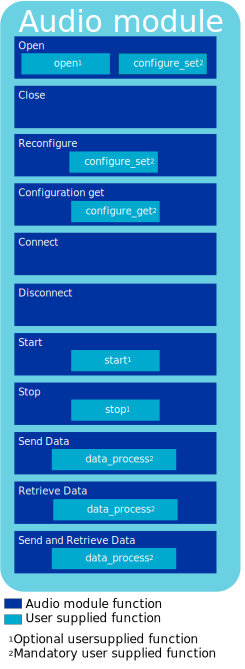
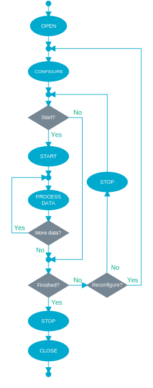
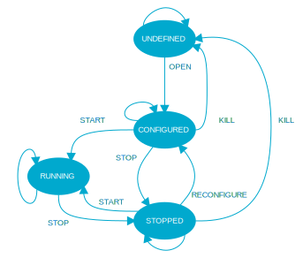
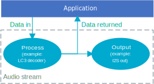

.. _lib_audio_module:

Audio module
############

.. contents::
   :local:
   :depth: 2

The audio module library is an interface to audio processing functions that coordinate audio states and the exchange of audio-related data of an LE Audio application, such as :ref:`nrf5340_audio`.

Overview
********

The audio module is an interface for constructing custom audio processing modules, such as decoder, encoder, and I2S output.
It provides a common interface to audio processing algorithms.

Using this interface, you can open and configure the custom modules, connect to them, and start and stop them.
You can also send audio data to and from the application.

The operation of the module is determined by a set of functions that perform the processing.
Connecting these modules lets you create the following audio system or stream:

.. figure:: images/audio_module_stream.svg
   :alt: Audio stream example

Implementation
==============

The audio module is implemented as a set of functions, listed in the following figure:

These functions call out to the user's implementation of these functions written to a predetermined API for the desired audio algorithm.

The following table outlines the available functions that are defined in struct audio_module_functions and whether they are mandatory or not:

.. list-table::
    :header-rows: 1

    * - Function
      - Mandatory/Optional
      - Comment
    * - open
      - Optional
      - Perform any algorithm operations to open.
    * - close
      - Optional
      - Tidy up the algorithm on a close.
    * - configure_set
      - Mandatory
      - Configure the algorithm to perform a particular operation.
    * - configuration_get
      - Mandatory
      - Return the internal configuration of the algorithm.
    * - start
      - Optional
      - Set the algorithm running.
    * - audio_module_stop
      - Optional
      - Stop the algorithms.
    * - data_process
      - Mandatory
      - Process the data for the algorithm.

The audio algorithm can run only if these functions are combined with the audio module.
The audio module cannot perform a task on its own, as it merely supplies a consistent way to interface to an audio algorithm.

The following figures show the flow and the internal states of the audio module:

Configuration
*************

To use the audio module library, set the following Kconfig options to ``y`` in the project configuration file :file:`prj.conf`:

* :kconfig:option:`CONFIG_AUDIO_MODULE`
* :kconfig:option:`CONFIG_DATA_FIFO`

Application integration
***********************

To create your own audio module for an LE Audio application, complete the following steps:

#. Write the mandatory functions required by the function table API in `Implementation`_.
#. Write any optional functions.
#. Assign the function table to an instance of an audio module.
#. Build with the audio module API and link together with the application.

The audio application opens the module, configures it and connects it to other modules or the application.
The module can then be started and you can send data to it and get the data from it.
You can also integrate a different module or output using an audio peripheral module.

The following figure demonstrates a simple decoding stream where the decoded audio is sent to an I2S output and returned to the application:

Dependencies
************

This library uses the following |NCS| library:

* :ref:`lib_data_fifo`

API documentation
*****************

| Header file: :file:`include/audio_module/audio_module.h`
| Source files: :file:`subsys/audio_module/audio_module.c`

.. doxygengroup:: audio_module
   :project: nrf
   :members:
