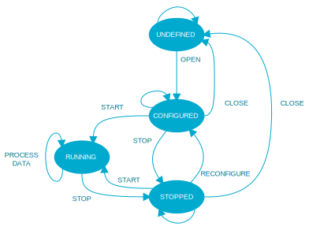

.. _lib_audio_module:

Audio module
############

.. contents::
   :local:
   :depth: 2

The audio module library is an interface to audio processing functions that coordinate audio states and the exchange of audio-related data of an LE Audio application, such as :ref:`nrf5340_audio`.

Overview
********
The audio module is an interface for construction of audio processing modules (e.g. decoder, encoder, I2S output, etc.).
This gives a common interface to audio processing algorithms. The interface allows the module to be opened, configured, connected to, started/stopped and data sent to/from the application.

The operation of the module is determined by the designer with a set of functions that perform the processing.
Connecting these modules allows an audio system or stream to be formed as illustrated below:

.. figure:: images/audio_module_stream.svg
   :alt: Audio stream example

Implementation
==============
The audio module is implemented as a set of functions. These functions call out to the users implementation of these functions written to a predetermined API for the desired audio algorithm.
The functions are illustrated below:

.. figure:: images/audio_module_functions.svg
   :alt: Audio module functions

The functions required to be supplied by the user are outlined in the following table:

.. list-table::
    :header-rows: 1

    * - Function
      - Mandatory/Optional
      - Comment
    * - open
      - optional
      - Perform any algorithm operations to open
    * - close
      - optional
      - Tidy up the algorithm on a close
    * - configure_set
      - mandatory
      - Configure the algorithm to perform a particular operation
    * - configure_get
      - mandatory
      - Return the internal configuration of the algorithm
    * - start
      - optional
      - Set the algorithm running
    * - stop
      - optional
      - Stop the algorithms
    * - data_process
      - mandatory
      - Process the data for the algorithm

Once these are combined with the audio module then an audio algorithm maybe performed. On it's own the audio module can not perform a task, it merely supplies a consistent way to interface to an audio algorithm.

The flow and internal states of the audio module are given in the following:

.. figure:: images/audio_module_flow.svg
   :alt: Audio module flow

Configuration
*************

To use the audio module library, enable the :kconfig:option:`AUDIO_MODULE` Kconfig option  to ``y`` in the project configuration file :file:`prj.conf`.

Usage
*****

The steps to creating an audio module ar as follows:

#. Write the mandatory functions required by the function table API.
#. Write any optional functions listed in the function table that are also required.
#. Assign the function table to an instance of an audio module.
#. Build with the audio module API and link together with the application.

The audio application should then open the module, configure it and connect it to other module(s) or the application.
It may then be started and data sent to it and the data retrieved from the it and/or a later module or output via an audio peripheral module.

The following figure illustrate a simple decoding stream where the decoded audio is sent to an I2S output and returned to the application.

.. figure::images/audio_module_example.svg
   :alt: Audio module stream example

Samples using the library
*************************

The following |NCS| test application uses this library:

:ref:`tests/subsys/audio_module`

Dependencies
************

The audio module depends upon the data_fifo. To enable the library, set the :kconfig:option:`CONFIG_DATA_FIFO` Kconfig option to ``y`` in the project configuration file :file:`prj.conf`.

API documentation
*****************

| Header file: :file:`include/audio_module/audio_module.h`
| Source files: :file:`subsys/audio_module/audio_module.c`

.. doxygengroup:: audio_module
   :project: nrf
   :members:
